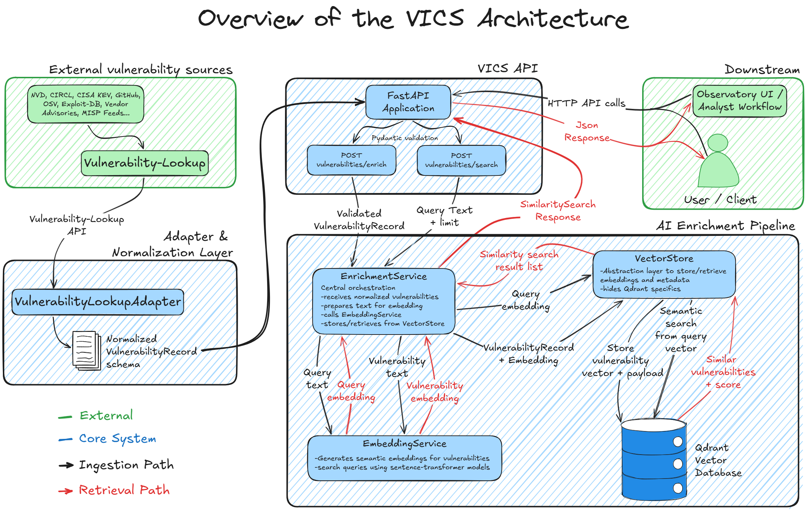

# Architecture and Design - Vulnerability Intelligence Correlation Service (VICS)

## 1. Objective

This document describes the architecture and design of an **Vulnerability Intelligence Correlation Service (VICS)** that integrates with Vulnerability-Lookup. It specifically addresses Task 3, Part 1 of the exercise, which requires an architecture diagram, service decomposition, data storage strategy, ingestion and retrieval pipeline, inference strategy, security concerns, scaling assumptions, and optional observability and evaluation considerations.

The proposed service consumes vulnerability records provided by Vulnerability-Lookup, normalizes them into an internal VulnerabilityRecord schema, generates semantic embeddings, stores the resulting vectors and metadata in Qdrant, and exposes similarity search through a FastAPI API. Its purpose is to add a semantic correlation layer on top of structured vulnerability intelligence, allowing analysts or downstream systems to retrieve vulnerabilities that are similar in meaning, even when descriptions differ in wording, source, or language.

The scope of the implemented V1 is intentionally focused. It covers vulnerability normalization, embedding generation, vector storage, and similarity search. It does not implement generative advisory drafting, autonomous severity reassessment, or the full Luxembourg-specific prioritization layer described in the broader strategic proposal. These capabilities can be added later as downstream extensions, but they are not part of the core VICS described in this document.

## 2. High-Level Architecture

The proposed architecture adds an AI-assisted semantic correlation service downstream of Vulnerability-Lookup. Vulnerability-Lookup acts as the consolidated vulnerability intelligence source, aggregating records from sources such as NVD, CISA KEV, OSV, GitHub Advisory Database, GitLab Advisory Database, MISP communities, vendor advisories, Exploit-DB, Packet Storm Security and FortiGuard Labs.

VICS does not directly consume each original external source. Instead, it integrates with Vulnerability-Lookup through a dedicated `VulnerabilityLookupAdapter`, which transforms Vulnerability-Lookup records into the internal `VulnerabilityRecord` schema. This keeps the AI service focused on enrichment and correlation, while avoiding duplication of the collection and aggregation role already handled by Vulnerability-Lookup.

Once a vulnerability record has been normalized, the enrichment pipeline generates a semantic embedding, stores the embedding and useful metadata in Qdrant, and exposes similarity search through the FastAPI API. Analysts or downstream observatory components can then submit a query and retrieve semantically related vulnerabilities with similarity scores and associated metadata.



The architecture is intentionally modular. Vulnerability-Lookup remains responsible for vulnerability aggregation and structured intelligence, while the AI service provides semantic enrichment, vector indexing and similarity search capabilities.

## 3. Service Decomposition

VICS is decomposed into small components with clear responsibilities. The objective is to keep the AI correlation layer maintainable, testable and easy to evolve without tightly coupling the API, the embedding model, the normalization logic and the vector database.

### 3.1 FastAPI Application

The FastAPI application exposes the HTTP interface of VICS. It receives vulnerability enrichment requests and similarity search queries, validates incoming payloads, and delegates the business logic to the enrichment pipeline.

The implemented API exposes three main endpoints:

- `GET /health` : verifies that the API is running;
- `POST /vulnerabilities/enrich` : enriches and stores a normalized vulnerability record;
- `POST /vulnerabilities/search` : retrieves semantically similar vulnerabilities.

The API layer should remain thin. It is responsible for request validation, response formatting and routing, but it does not directly generate embeddings or interact with Qdrant. This separation keeps the HTTP layer independent from the AI and storage implementation details.

### 3.2 VulnerabilityLookupAdapter

`VulnerabilityLookupAdapter` is responsible for transforming records coming from Vulnerability-Lookup into the internal `VulnerabilityRecord` schema.

This adapter is the only source adapter in the proposed architecture. The reason is intentional: Vulnerability-Lookup already aggregates and consolidates vulnerability data from multiple upstream sources. VICS should therefore integrate with Vulnerability-Lookup rather than duplicate its collection and normalization role.

If the Vulnerability-Lookup response format evolves, the adapter can be updated while keeping the rest of the enrichment pipeline stable.

### 3.3 VulnerabilityRecord Schema

`VulnerabilityRecord` is the normalized internal schema used by VICS. It provides a stable contract between the Vulnerability-Lookup adapter and the enrichment pipeline.

It contains the core fields required for semantic correlation, such as the vulnerability identifier, title, description, severity, CVSS score, source and language. It also provides a method to convert structured vulnerability data into embedding-ready text.

This schema is important because the embedding pipeline should not depend directly on the raw Vulnerability-Lookup JSON structure. Once a record has been mapped to `VulnerabilityRecord`, the rest of the system can process it consistently.

### 3.4 EnrichmentService

`EnrichmentService` is the orchestration component of the enrichment pipeline. It coordinates the transformation of normalized vulnerability records into semantic vectors and the retrieval of similar vulnerabilities.

For enrichment, it receives a validated `VulnerabilityRecord`, prepares the text representation, calls the embedding service, and delegates vector storage to the vector store. For similarity search, it receives a query, generates a query embedding, and asks the vector store to retrieve semantically close records.

This component contains the application logic but remains independent from FastAPI routing and Qdrant-specific implementation details.

### 3.5 EmbeddingService

`EmbeddingService` is responsible for semantic embedding generation. It converts vulnerability records and search queries into numerical vectors using a configurable embedding model.

The embedding model is encapsulated inside this service to keep the architecture model-agnostic. This makes it possible to replace the embedding model later without changing the API routes, the normalized data schema or the vector store interface.

For multilingual vulnerability data, this component can use a multilingual embedding model, allowing the system to correlate vulnerability records even when descriptions are written in different languages.

### 3.6 VectorStore

`VectorStore` is the abstraction layer between the enrichment logic and Qdrant. It exposes application-level operations such as upserting a vulnerability vector and searching for similar vulnerabilities.

This abstraction prevents the rest of the application from depending directly on Qdrant client calls. If the vector database configuration, collection name or query logic changes, the impact remains localized inside the vector storage layer.

The upsert logic uses deterministic point identifiers based on the vulnerability identifier, which allows idempotent re-ingestion of the same vulnerability record.

### 3.7 Qdrant Vector Database

Qdrant stores vulnerability embeddings and associated metadata payloads. It is used as the semantic index of VICS.

The metadata payload allows the API to return useful information together with similarity scores, such as the vulnerability identifier, title, description, severity, CVSS score, source and language.

Qdrant is accessed only through the `VectorStore` abstraction. This keeps vector database operations isolated from the rest of the application and makes the system easier to maintain.

## 4. Integration with Vulnerability-Lookup

VICS integrates with Vulnerability-Lookup through its API and a dedicated normalization boundary implemented in `app/adapters/vulnerability_lookup_adapter.py`.

Vulnerability-Lookup is treated as the direct vulnerability intelligence source of VICS. It already aggregates vulnerability information from multiple upstream sources, including NVD, CISA KEV, OSV, GitHub Advisory Database, GitLab Advisory Database, MISP communities, vendor advisories, Exploit-DB, Packet Storm Security and FortiGuard Labs. The role of VICS is therefore not to collect or normalize each of these sources independently, but to consume vulnerability records exposed by the Vulnerability-Lookup API and enrich them semantically.

`VulnerabilityLookupAdapter` is responsible for calling, receiving, or processing records from Vulnerability-Lookup and transforming them into the internal `VulnerabilityRecord` schema. This design keeps the enrichment pipeline independent from the raw Vulnerability-Lookup response format. If the upstream API response format changes, the adapter can be updated without modifying the VICS API layer, the embedding service, the vector store or the Qdrant storage logic.

In the implemented V1, VICS can enrich records once they are represented as normalized `VulnerabilityRecord` objects. The adapter completes the integration by making Vulnerability-Lookup API records compatible with that internal format before they enter the enrichment pipeline.

## 5. Data Ingestion and Retrieval Strategy

VICS supports two main data flows: ingestion of vulnerability records and retrieval of semantically similar vulnerabilities. Both flows rely on the same enrichment pipeline introduced in the high-level architecture, but they serve different purposes.

For ingestion, the process starts from a vulnerability record provided by Vulnerability-Lookup. The `VulnerabilityLookupAdapter` maps this record into the internal `VulnerabilityRecord` schema. Once validated, the record is converted into embedding-ready text, embedded by `EmbeddingService`, and stored through `VectorStore` in Qdrant with its metadata payload.

The ingestion logic uses deterministic point identifiers derived from the vulnerability identifier. In the implemented V1, this is done with UUIDv5 based on `vulnerability_id`. This makes re-ingestion idempotent: if the same vulnerability is processed again, the existing vector and metadata are updated instead of creating a duplicate point.

For retrieval, a search query submitted through the API is embedded at runtime using the same embedding service. The resulting query vector is passed to `VectorStore`, which searches Qdrant for semantically close vulnerability records. The query itself is not stored as a vulnerability record; it is only used to retrieve similar vectors.

The response contains ranked vulnerability results with similarity scores and metadata such as vulnerability identifier, title, severity, CVSS score, source and language. This allows analysts or downstream observatory components to inspect related vulnerabilities without manually comparing descriptions across records.

## 6. Data Storage Strategy

The storage strategy separates structured vulnerability intelligence from semantic indexing. Vulnerability-Lookup provides the consolidated vulnerability records consumed by VICS, while Qdrant stores the vector representations required for semantic similarity search.

Each enriched vulnerability is stored in Qdrant as a vector point. The point contains the semantic embedding generated from the normalized vulnerability text and a metadata payload with the fields needed to interpret search results, such as the vulnerability identifier, title, description, severity, CVSS score, source and language.

Payload example:

```json
{
  "vulnerability_id": "CVE-2024-0001",
  "title": "Remote code execution in web application",
  "description": "An attacker can remotely execute arbitrary code through a vulnerable endpoint.",
  "severity": "critical",
  "cvss_score": 9.8,
  "source": "Vulnerability-Lookup",
  "language": "en"
}
```

The service uses deterministic point identifiers based on `vulnerability_id`. This allows the same vulnerability to be re-ingested safely: the existing vector and payload are updated instead of creating duplicate records. This behavior is important for scheduled synchronization, updated vulnerability descriptions, or future reprocessing campaigns.

The vector database should also support collection versioning. If the embedding model changes, existing vectors should not be mixed with vectors produced by the new model, because different embedding models produce different vector spaces. A safe migration path is to create a new Qdrant collection, re-embed the vulnerability records, evaluate retrieval quality, and then switch the API configuration to the new collection once validated.

## 7. Inference Strategy

The implemented V1 relies on embedding inference. Its purpose is to transform vulnerability records and search queries into semantic vectors that can be compared in Qdrant.

During ingestion, the normalized vulnerability record is converted into embedding-ready text and passed to `EmbeddingService`. During retrieval, the user query follows the same principle: it is embedded at runtime and compared against stored vulnerability vectors. This keeps the inference logic simple and consistent across both enrichment and search.

The embedding model is encapsulated inside `EmbeddingService`, which keeps the rest of the application independent from a specific model implementation. The model can therefore be replaced to improve multilingual retrieval quality, reduce latency, support larger volumes, or adopt a more domain-specific cybersecurity embedding model.

If the embedding model changes, the existing vectors should be regenerated in a new versioned Qdrant collection. Embeddings produced by different models should not be mixed in the same collection, because their vector spaces are not directly comparable.

Generative inference is not part of the implemented V1. It can be added later as a downstream capability for advisory drafting, summarization or translation, but VICS described here is based on semantic embeddings and similarity search.

## 8. Security Concerns

VICS processes vulnerability intelligence and exposes enrichment and similarity search capabilities. In production, it should therefore be protected as an internal service rather than exposed as an unauthenticated public API.

Authentication and authorization should be enforced at the API boundary. The enrichment endpoint modifies the semantic index and should be restricted to trusted services, such as the Vulnerability-Lookup adapter, scheduled ingestion jobs or authorized analysts. The search endpoint has a lower integrity impact, but it can still reveal operational interests through analyst queries and returned correlations. Role-based access control should therefore distinguish ingestion, search and administration permissions.

The main production controls are:

- authentication and authorization at the API boundary;
- role-based access control for ingestion, search and administration;
- strict input validation and request size limits;
- private Qdrant access through the `VectorStore` only;
- redacted logging and controlled access to operational logs;
- dependency, container image and model provenance checks.

Input validation is also required before records enter the enrichment pipeline. The V1 already relies on Pydantic validation through the `VulnerabilityRecord` schema. A production version should additionally enforce maximum field lengths, accepted language values, accepted source values, request size limits and rejection of empty or low-quality descriptions.

Qdrant should remain private and accessible only through the `VectorStore` component. Direct access to the vector database would bypass API validation, authorization and application-level controls. Network isolation, Qdrant authentication where available, collection backups and monitoring of query volume should be part of the deployment baseline.

Logs should support debugging without exposing unnecessary operational context. Full request bodies, analyst queries, credentials, tokens and sensitive internal metadata should not be logged by default. Logs should favor request identifiers, endpoint names, vulnerability identifiers, status codes, validation failures and storage errors.

VICS also depends on open-source libraries, container images and embedding models. Dependency pinning, vulnerability scanning, model provenance checks and license review are required to reduce supply chain risk. If generative advisory drafting is added later, additional controls will be needed for prompt injection, hallucinated remediation guidance and human validation before publication.

## 9. Scaling Assumptions

The proposed architecture is designed to start as a lightweight internal service and scale progressively as ingestion volume, query volume and model complexity increase.

The FastAPI layer should remain stateless, allowing multiple API workers or instances to run behind a load balancer. Persistent state is kept outside the API process: semantic vectors and metadata are stored in Qdrant, while consolidated vulnerability intelligence is provided by Vulnerability-Lookup.

Embedding generation is the main compute bottleneck. For a first version, a lightweight multilingual embedding model can run on CPU. If ingestion volume increases, the system can evolve toward batch processing, asynchronous ingestion workers, queue-based enrichment, or GPU-backed inference for larger models. Embeddings should be reused when vulnerability content has not changed.

For large-scale batch workloads, the enrichment pipeline can also be executed outside the interactive API path through HPC, scheduled jobs or batch-processing infrastructure. This is relevant for historical backfills, large embedding regeneration campaigns after a model migration, evaluation runs, or enrichment of high-volume vulnerability datasets. In that case, FastAPI remains the interactive API layer, while offline jobs run the enrichment pipeline and write vectors into Qdrant.

Qdrant should be monitored and sized according to the expected number of vulnerability records, vector dimension, query volume and latency requirements. Search latency can be controlled through result limits, appropriate index configuration, collection sizing and monitoring of latency percentiles rather than only average latency.

For larger deployments, separate Qdrant collections can be used when there is a clear operational boundary, such as data sensitivity, environment, or embedding model version. Severity-based separation may also be considered if it supports a real analyst workflow, for example faster access to critical and high-severity vulnerabilities. However, collections should not be split prematurely based only on semantic proximity, because this can reduce recall and add routing complexity.

If the embedding model changes, a new versioned collection should be created. Vectors produced by different embedding models should not be mixed in the same collection, because their vector spaces are not directly comparable.

## 10. Observability Approach

Observability should cover both technical reliability and retrieval quality. For this service, it is not enough to know whether the API is running; it is also necessary to detect whether ingestion is failing, whether embedding inference is becoming slow, or whether similarity search quality is degrading over time.

The most relevant observability signals are:

* API request volume, latency and error rate by endpoint;
* enrichment latency and embedding generation time;
* Qdrant query latency and storage failures;
* number of records processed, rejected, updated or failed;
* distribution of similarity scores;
* number of empty or low-confidence result sets;
* analyst feedback on returned vulnerabilities.

These signals help distinguish infrastructure issues from AI retrieval quality issues. For example, a spike in validation failures may indicate a change in the Vulnerability-Lookup response format, while a sudden drop in similarity scores may indicate a normalization problem, an embedding model mismatch or poor-quality input data.

Logs should support debugging without exposing unnecessary operational context. They should include request identifiers, endpoint names, vulnerability identifiers, collection names, model names, validation failures and storage errors. Full request payloads, full analyst queries, credentials and sensitive operational metadata should not be logged by default.

## 11. Evaluation Metrics

Evaluation should verify that VICS returns useful vulnerability correlations, not only that the API and vector database are running correctly. The implemented V1 should therefore be evaluated mainly on semantic retrieval quality, data quality and operational performance.

Retrieval quality can be measured with a small benchmark made of vulnerability queries and expected related records. The most relevant metrics are:

* `Precision@k` : measures how many of the top-k returned vulnerabilities are relevant;
* `Recall@k` : measures whether known related vulnerabilities are retrieved within the top-k results;
* `Mean Reciprocal Rank (MRR)` : measures whether the first relevant result appears high in the ranking;
* `low-confidence result rate` : identifies queries for which the system returns weak or unreliable matches.

Quantitative metrics should be complemented with analyst feedback. Analysts should be able to indicate whether returned vulnerabilities are relevant, too broad, too narrow, duplicated, or missing important related records. This feedback can later be used to improve the adapter, the text representation used for embeddings, the embedding model choice, similarity thresholds or ranking logic.

Data quality should also be evaluated because poor input records directly affect embedding quality. Useful indicators include missing descriptions, very short descriptions, inconsistent severity values, duplicate vulnerability identifiers, language distribution, source distribution and validation rejection rate.

Regression checks should be performed before major changes, especially when modifying the `VulnerabilityLookupAdapter`, changing the embedding model, adding new Vulnerability-Lookup fields to the embedding text, or migrating to a new Qdrant collection. This reduces the risk of silent degradation in similarity search quality.


## 12. Maintainability and Evolution

The architecture is designed to remain maintainable by keeping clear boundaries between data normalization, API logic, embedding inference and vector storage. `VulnerabilityLookupAdapter` isolates the service from the raw Vulnerability-Lookup response format, while `VulnerabilityRecord` provides a stable internal schema for the enrichment pipeline.

The embedding model is encapsulated inside `EmbeddingService`, which allows the model to be replaced without rewriting the API, the adapter or the vector storage logic. This is important because multilingual and cybersecurity-oriented embedding models are likely to improve over time. Model changes should be handled through versioned Qdrant collections and retrieval-quality regression checks.

The `VectorStore` abstraction keeps Qdrant-specific operations isolated from the rest of the application. This makes it easier to adjust collection configuration, search parameters, metadata payloads or storage implementation details without changing the VICS orchestration layer.

The V1 is intentionally focused on semantic enrichment and similarity search. This makes it a maintainable first implementation of VICS. Future extensions can add asynchronous ingestion, analyst feedback loops, richer ranking logic, Luxembourg-specific prioritization signals, or generative advisory drafting, while keeping the core correlation pipeline stable.
